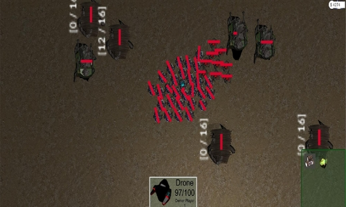

# It seems as if you only just arrived

[About Me](#me) - [Working on](#current-projects) - [Games](#games) - [Demos](#demos)


## Me

> Trying to make life easier
>
> Ask me anything at : vvrouliotis@gmail.com
>
>My [CV](https://my.pcloud.com/publink/show?code=XZ9DI4kZfBARDObyEWkjvRD1xoWCbBMAIVN7)
>
> [LinkedIn](https://www.linkedin.com/in/vvrouliotis/)
>
> Find my [projects](https://github.com/vvroul?tab=repositories)
>
> Some [Tweet](https://twitter.com/vvroul) fun
>
> [Steam](https://steamcommunity.com/id/vvroul/)


* * *

## Current Projects


> [QolC Programming Language](https://github.com/qolc-lang/QolC) : building my own programming language for fun!
>
***

Mods

> [Overtaken](https://github.com/vvroul/Overtaken) : my first Half Life 2 mod 

Work in progress : 


> [Eternal Darkness](https://github.com/vvroul/eternal_darkness) : my first Cod Waw Zombies map

Work in progress : 


>[Don't Starve - Abathur Mod](https://github.com/vvroul/abathur-mod) : Abathur is coming in DS

Work in progress : 


* * *


## Games


> #### My first game ever : [Dragon's Path](https://github.com/vvroul/Dragon-s-Path)


>[Qwebra](https://gamejolt.com/games/qwebra/39922)


>[Macho Rampage](https://gamejolt.com/games/macho-rampage/79964)


>[Now What?](https://globalgamejam.org/2015/games/now-what-1)


* * *

## Demos

> [3D RTS Demo](https://github.com/vvroul/3D-rts-demo)



> [LastOneLoses](https://github.com/vvroul/LastOneLoses)


```
And so, whether you are here to stay, or passing through on your way to parts unknown, welcome to my webpage. It's safer here.
```
