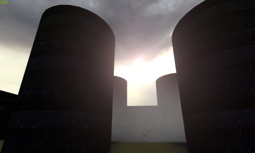
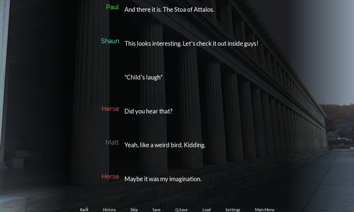
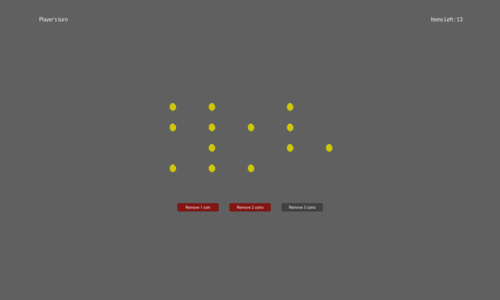

# 
 Vrouliotis Vasileios 
 
 Game Designer / Software Engineer

[Current Projects](#current-projects) &nbsp; &nbsp; | &nbsp; &nbsp; [Games](#games) &nbsp; &nbsp; | &nbsp; &nbsp; [Mods](#mods) &nbsp; &nbsp; | &nbsp; &nbsp;[Visual Novels](#visual-novels)&nbsp; &nbsp; | &nbsp; &nbsp; [Demos](#demos) &nbsp; &nbsp; | &nbsp; &nbsp; [About](#me) &nbsp; &nbsp; | &nbsp; &nbsp; [Contact](#contact)

## Current Projects

## Games

[Dragon's Path](https://github.com/vvroul/Dragon-s-Path)

[Qwebra](https://gamejolt.com/games/qwebra/39922)

[Macho Rampage](https://gamejolt.com/games/macho-rampage/79964)

[Now What?](https://globalgamejam.org/2015/games/now-what-1)

## Mods

[Overtaken](https://github.com/vvroul/Overtaken) : my first Half Life 2 mod

[Eternal Darkness](https://github.com/vvroul/eternal_darkness) : my first Cod Waw Zombies map

[Don't Starve - Abathur Mod](https://github.com/vvroul/abathur-mod) : Abathur is coming in DS

## Visual Novels

> [Mystery in the Agora](https://pergamos.lib.uoa.gr/uoa/dl/object/2073223) : A Visual Novel for my thesis

> [Connection Established](https://github.com/vvroul/connection_established_vn) : Visual Novel about a parallel universe story

## Demos

> [3D RTS Demo](https://github.com/vvroul/3D-rts-demo)

> [LastOneLoses](https://github.com/vvroul/LastOneLoses)

> [Alteration RPG](https://github.com/vvroul/AlterationRPG)

