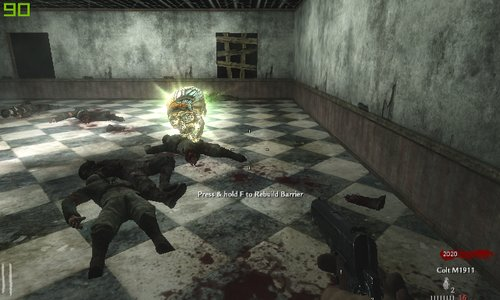
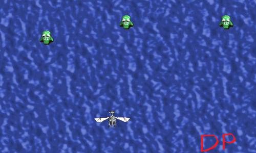
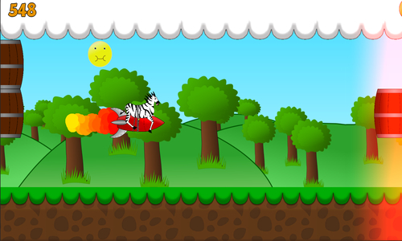

# Vrouliotis Vasileios

[About & Resume](#me) &nbsp; / &nbsp; [Current Projects](#current-projects) &nbsp; / &nbsp; [Mods](#mods) &nbsp; / &nbsp; [Games](#games) &nbsp; / &nbsp; [Novels](#visual-novels) &nbsp; / &nbsp; [Demos](#demos)

## In progress projects

[Land of Crystals](https://landofcrystalsgame.tumblr.com/)

> collectathon/exploration game about overcoming your vulnerabilities by collecting and cleansing a wide variety of healing crystals.

## Mods

[Overtaken](https://github.com/vvroul/Overtaken) : my first Half Life 2 mod

[Eternal Darkness](https://github.com/vvroul/eternal_darkness) : my first Cod Waw Zombies map

[Don't Starve - Abathur Mod](https://github.com/vvroul/abathur-mod) : Abathur is coming in DS

## Games

#### My first game ever : [Dragon's Path](https://github.com/vvroul/Dragon-s-Path)

[Qwebra](https://gamejolt.com/games/qwebra/39922)

[Macho Rampage](https://gamejolt.com/games/macho-rampage/79964)

[Now What?](https://globalgamejam.org/2015/games/now-what-1)

## Visual Novels

[Mystery in the Agora](https://pergamos.lib.uoa.gr/uoa/dl/object/2073223) : A Visual Novel for my thesis

[Connection Established](https://github.com/vvroul/connection_established_vn) : Visual Novel about a parallel universe story

## Demos

[3D RTS Demo](https://github.com/vvroul/3D-rts-demo)

[LastOneLoses](https://github.com/vvroul/LastOneLoses)

[Alteration RPG](https://github.com/vvroul/AlterationRPG)

## About Me

Trying to make life easier

Ask me anything at : vvrouliotis@gmail.com

[LinkedIn](https://www.linkedin.com/in/vvrouliotis/)

Find my [projects](https://github.com/vvroul?tab=repositories)

Some [Tweet](https://twitter.com/vvroul) fun
